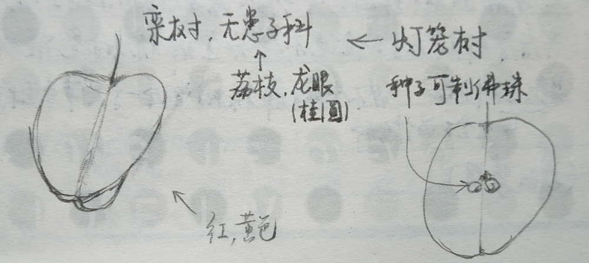

# 我与地坛
> 史铁生  
> 2019-01-26 ~ 27 摘录(重读)  
> 2021-02-19 整理

## 我与地坛

1. 十五年前的一个下午，我摇着轮椅进入园中，它为一个失魂落魄的人把一切都准备好了。那时，太阳循着亘古不变的路途正越来越大，也越红。在满园弥漫的沉静光芒中，一个人更容易看到时间，并看见自己的身影。
2. 十五年中，这古园的形体被不能理解它的人肆意雕琢，幸好有些东西是任谁也不能改变的，譬如祭坛石门中的落日，寂静的光辉平铺的一刻，地上的每一个坎坷都被映照得灿烂。
3. 味道甚至是难于记忆的，只有你又闻到它你才能记起它的全部情感和意蕴。 _//声音有时也是_
4. 多年来我头一次意识到，这园中不单是处处都有过我的车辙，有过我车辙的地方也都有过母亲的脚印。
5. 那儿有几棵大栾树，春天开一簇簇细小而稠密的黄花，花落了便结出无数如同三片叶子合抱的小灯笼，小灯笼先是绿色，继而转白，再变黄，成熟了掉落得满地都是。
6. 要是有些事情我没说，地坛，你别以为是我忘了，我什么也没忘，但是有些事只适合收藏。不能说，也不能想，却又不能忘，它们不能变成语言......它们是一片朦胧的温馨与寂寥，是一片成熟的希望与绝望，它们的领地只有两处：心与坟墓。比如邮票，有些是用于寄信的，有些仅仅是为了收藏。
7. 而对一个情人来说，不管多么漫长的时光也是稍纵即逝，那时他便明白，每一步每一步，其实一步步都是走在回去的路上。 _//时间在此刻凝止，钟声依旧，青春年少的时光，仿佛在此时变慢、老去。_
8. 但是太阳，它每时每刻都是夕阳也都是旭日。 _//但只是某个人的夕阳**或**旭日_

## 合欢树

1. “到小院儿去看看吧，你妈种的那棵合欢树今年开花了！”
2. 有一天那个孩子长大了，会想起童年的事，会想起那些晃动的树影儿，会想起他自己的妈妈。他会跑去看看那棵树。但他不会知道那棵树是谁种的，是怎么种的。 _//不会知道那棵树曾给一个人带来怎样的希望_

## 我的梦想

1. 我希望既有一个健美的躯体又有一个了悟人生意义的灵魂。我希望二者兼得。但是，前者可以祈望上帝的思赐，后者却必须在千难万苦中靠自己去获取……千万不要说，倘若两者不可兼得你要哪一个？不要这样说，因为人活着必要有一个最美的梦想。

## 好运设计

1. 怕只怕苦也不尽，甜也不来，其实都用不着甜得很厉害，只要苦尽也就够了。其实也用不着什么甜，苦尽了也就很甜了。
2. 你立于目的的绝境却实现着，欣赏着、饱尝着过程的精彩，你便把绝境送上了绝境。...当生命以美的形式证明其价值的时候，幸福是享受，痛苦也是享受。...但是，除非你看到了目的的虚无你才能够进入这审美的境地，除非你看到了目的的绝望你才能找到这审美的救助。

## 轻轻地走与轻轻地来

1. 生和死都不过取决于观察，取决于观察的远与近，比如，当一颗距离我们数十万光年的星星实际早已熄灭，它却在我们的视野里度着它的青年时光。 _//也在别人的视野里刚刚降临_

## 二姥姥

1. 母亲又说：“她**应该**嫁人了。”  
   我听不出“应该”二字是指**必要**，还是指**可能**。我听不出母亲这句话是宽慰还是忧虑。

## 记忆与印象

1. 历史的每一瞬间，都有无数的历史蔓展，都有无限的时间延伸，我们生来孤单，无数的历史和无限的时间因破碎而成片段。互相埋没的心流，在孤单中祈祷，在破碎处眺望，或可指望在梦中团圆。记忆，所以是一个牢笼，印象是牢笼以外的天空。

## 想念地坛

1. 写(写作，自我思考)，真是个办法，油然地通向安静。写，这形式，注定是个人的，容易撞见诚实，容易被诚实揪住不放，容易在市场之外遭遇心中的阴暗，在自以为是时回归零度(kernel, 核)。把一切污浊、畸形、歧路，重新放回到那儿去检查，勿使伪劣的心魂流布。

## 扶轮问路

1. 尼采说“要爱命运”，爱命运才是至爱的境界。...而凡·高所说的“经历生活”，分明是在暗示：此一处陌生的地方，不过是心魂之旅中的一处景观，一次际遇，未来的路途一样还是无限之间。
