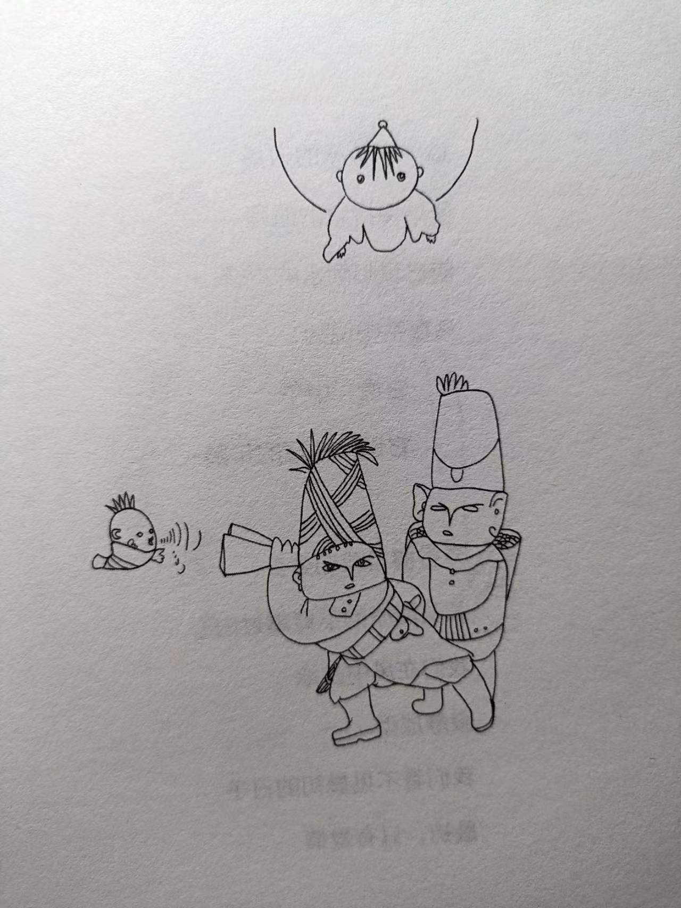

# 顾城的诗 顾城的画
> 顾城  
> 2022-09-10 ~ 16 摘录  
> 2023-02-25 整理

## 奇遇
  
闭很久的眼睛是一种技术，我不想告诉别人，因为弄不好你就回不了你原来的院子了，特别是你当过鸟和老虎之后，你就很可能坐到屋顶或者烟囱上，这样如果正好没有梯子的话是很危险的。

## “需要一个答案”
  
这是最美的阴影  
可以摇动阳光  
轻轻走下山去  
酒杯叮当作响  
......  
这是最美的太阳  
把花印在地上  
谁要捡走影子  
谁就拾走光芒。

## 信念
  
土地上生长着信念  
有多少秋天就有多少春天  
是象就要长牙  
是蝉就要振弦  
我将重临这个世界  
我是一道光线  
也是一缕青烟。  

## 我们去寻找一盏灯
  
走了那么远  
我们去寻找一盏灯  

你说  
它在窗帘后面  
被纯白的墙壁围绕  
从黄昏迁来的野花  
将变成另一种颜色

## 土地是弯曲的
  
还是给我一朵云吧  
擦去晴朗的时间  
我的眼睛需要泪水  
我的太阳需要安眠  

## 不要在那里踱步
  
梦太深了  
你没有羽毛  
生命量不出死亡的深度  

## 分离
  
黑色的油污从山谷中浮起  
乌鸦会飞  
会带走我的羽毛  

我还将留在世界上  
在熄灭的细草中间  
心最后总要滚动一下  
才能变成石子

## 我曾是火中最小的花朵
  
“一个祖传的青砖镂刻的锅台  
一个油亮亮的大肚子铁锅  
红薯都在幸福地慢慢叹气  
火钳上燃着幽函的硫磺……”  
......  
在山坡的慌乱中我独自微笑  
热气把我的黑发卷入高空  
太阳会来的，我会变得淡薄  
最后幻入蔚蓝的永恒  _//我是一缕青烟_  

## 南国之秋 二
  
我要在最细的雨中  
吹出银色的花纹  
让所有在场的丁香  
都成为你的伴娘  

我要张开梧桐的手掌  
去接雨水洗脸  
让水杉用软弱的笔尖  
在风中写下婚约

## 异地
  
我忘了怎样痛哭  
怎样躲开天空  
我严肃地摇着电线  
希望能惊动鸟群  

## 剥开石榴
  
每个独自醒来的时候  
都可以看见如海的忧愁  
贤慧的星星  _//贤惠？慧星？_  
像一片积雪  
慢吞吞地在眼前漂流  

就像这样无止无休  
最大的炼狱就是烟斗  
一颗牙  
几团光亮的尘沫  _//我们也是星尘_  
上帝从来靠无中生有  

那些光还要生活多久月 _//光就是我们_  
柔软的手在不断祈求  
彼岸的歌  
是同一支歌曲  
轻轻啄食过我们的宇宙  

## 就在那个小村里
  
周围潜伏着透明的山岭  
泉水一样的风  
你眼睛的湖水中没有海草  
......  
村子里有树叶飞舞  
我们有一块空地  
不去问命运知道的事情  _//也不要偷听_

## 表达
  
我害恒  
瘦弱的人看过的春天  

## 复有笑容
  
古巷声声，弄瓦时  
诗随人 人随梦  
那本书很大 光线微斜  
他抄蝴蝶的名字  

我把枯萎的花放回地上  
死后的中午枕石而睡  
世界重又安定  
人群复有笑容。  

## 字典
  
世界在深处吐着银泡  
一次次企图依靠记忆  
我想起山上有一个字典  
被早晨的阳光翻来翻去  _//阳光即是字典_  

## 从心
  
两朵花在风中走近  
用芳香相互触摸  

最美的是界限  
微妙的边和转折

## 你喜欢歌谣
  
你喜欢歌谣 孩子  
唱过的树都倒了  
花开如火 也如寂寞  

## 岛
  
阳光 水 和灰烬  
一朵花的颜色  
爱的三个季节
